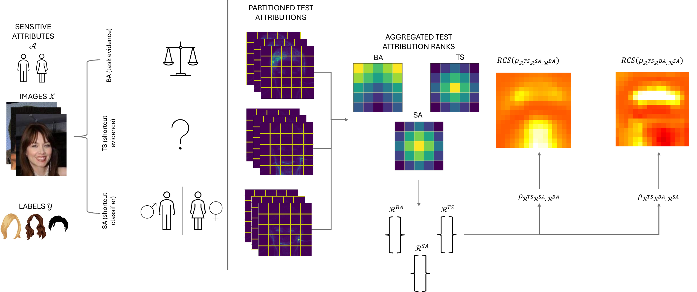

# OSCAR: Localising Shortcut Learning via Attribution Rank Correlations

This repository contains the code for OSCAR, a post-hoc auditing framework for shortcut learning in image models:

`Ordinal Scoring Correlations for Attribution Representations (OSCAR)`.

OSCAR compares attribution-derived region rankings from three models:

- `BA`: a balanced baseline model for the main task
- `TS`: the test model being audited
- `SA`: a sensitive-attribute predictor

<p align="center">
  
</p>
<p align="center">
  <em>
    Overview of the OSCAR pipeline: balanced baseline, test, and sensitive-attribute models are compared through
    partitioned attribution maps, aggregated regional ranks, and region contribution scores.
  </em>
</p>

At a high level, OSCAR works as follows:

1. Train `BA`, `TS`, and `SA`.
2. Compute attribution maps on a shared hold-out test set.
3. Partition each image into disjoint regions.
4. Turn per-image regional scores into ranks, then aggregate ranks across the dataset.
5. Compute pairwise, partial, and deviation-style correlations.
6. Build region contribution scores (RCS) to localise shortcut-aligned regions.

## Repository scope

The paper covers CelebA, CheXpert, and ADNI. The code in this repository currently maps to those experiments as follows:

- `2D`: CelebA and CheXpert experiments, including model training, attribution generation, region-wise rank construction, correlation analysis, and RCS-based mitigation.
- `3D`: ADNI experiments, including model training, attribution generation, registration to atlas space, and atlas-based rank construction.
- `Partition support`:
  - `2D`: the paper experiments use regular grid partitions and superpixel partitions for attribution rank extraction in [`src/explain_2d/attribution_statistics.py`](src/explain_2d/attribution_statistics.py).
  - `3D`: the ADNI workflow uses atlas-based partitions in [`src/explain/attribution_statistics.py`](src/explain/attribution_statistics.py).

## Layout

```text
config/                  YAML config for folders, tasks, and model aliases
docs/DATASET_SETUP.md    MRI dataset preparation notes
process/                 MRI metadata creation and volume preprocessing
scripts/                 Example shell wrappers
src/train*.py            2D/3D model training
src/evaluation*.py       2D/3D evaluation and 2D mitigation
src/explain*/            Attribution generation, partitions, rank extraction
src/vismethods_2d.py     2D OSCAR correlation and RCS computation
```

## Setup

```bash
git clone https://github.com/acharaakshit/oscar.git
cd oscar

conda create -n oscar python=3.10 -y
conda activate oscar
pip install -r requirements.txt

export PROJECTDIR=$PWD
export PREFIX=/path/to/datasets
export PYTHONPATH=$PROJECTDIR/src:$PROJECTDIR
```

Notes:

- `PREFIX` is the root folder path that holds dataset folders, checkpoints, attribution maps, and results.

## Datasets

### 2D experiments

- `celeba_gender`: Blond Hair as task, Male as sensitive attribute.
- `chexpert_pleuraleffusiongender`: Pleural Effusion as task, Sex as sensitive attribute.

The loaders live in [`src/datasets2d.py`](src/datasets2d.py). They construct:

- a balanced `BA` split when `--baseline` is set
- a sensitive-attribute `SA` training set when `--baseline --attribute` is set
- a shortcut-prone `TS` split otherwise

### 3D experiments

- `ADNI` is the main 3D path in the current repo.

The MRI preprocessing and metadata pipeline is driven by:

- [`process/metadata.py`](process/metadata.py)
- [`process/create_data_objects.py`](process/create_data_objects.py)
- [`src/create_splits.py`](src/create_splits.py)

## Running OSCAR

### 2D: train BA, TS, and SA

Example with CelebA and ResNet:

```bash
python -u src/train_2d.py --dataset celeba_gender --model resnet --in-channels 3 --batch-size 32 --seed 0
python -u src/train_2d.py --dataset celeba_gender --model resnet --baseline --in-channels 3 --batch-size 32 --seed 0
python -u src/train_2d.py --dataset celeba_gender --model resnet --baseline --attribute --in-channels 3 --batch-size 32 --seed 0
```

For the varying-shortcut-strength experiments used in the paper, use [`src/train_2d_samples_exp.py`](src/train_2d_samples_exp.py) with `--bias-samples-train` and `--bias-samples-val`.

### 2D: generate attribution maps

```bash
python -u src/explain_2d/vismethods.py --dataset celeba_gender --model resnet --method GradCAM --seed 0
python -u src/explain_2d/vismethods.py --dataset celeba_gender --model resnet --baseline --method GradCAM --seed 0
python -u src/explain_2d/vismethods.py --dataset celeba_gender --model resnet --baseline --attribute --method GradCAM --seed 0
```

Supported attribution methods in the checked-in 2D pipeline are:

- `GradCAM`
- `LRP`

### 2D: convert attribution maps to regional rank profiles

```bash
python -u src/explain_2d/attribution_statistics.py \
  --dataset celeba_gender \
  --model resnet \
  --method GradCAM \
  --partition_method grid \
  --regions 64 \
  --seed 0
```

Repeat for:

- `TS`: no `--baseline`
- `BA`: `--baseline`
- `SA`: `--baseline --attribute`

In the 2D experiments, the paper-style regional partitions correspond to:

- `grid`: `64` regions corresponds to an `8 × 8` grid, and `256` regions corresponds to a `16 × 16` grid
- `superpixel`: `64` and `256` regions correspond to superpixel partitions with the same numbers of regions

The checked-in 2D correlation sweep in [`src/vismethods_2d.py`](src/vismethods_2d.py) currently iterates over:

- `grid`
- `superpixel`

### 2D: compute OSCAR correlations and RCS

```bash
python -u src/vismethods_2d.py --outfile celeba_resnet --seeds 1
```

Important:

- [`src/vismethods_2d.py`](src/vismethods_2d.py) interprets `--seeds N` as a count and iterates over seeds `0..N-1`.
- The script writes correlation summaries and per-region contribution scores to `results/`.
- The analysis computes pairwise correlations, partial correlations, a deviation-style semipartial correlation, and per-region RCS values.

### 2D: evaluation and mitigation

Standard evaluation:

```bash
python -u src/evaluation_2d.py --dataset celeba_gender --model resnet --in-channels 3 --seed 0
```

RCS-based mitigation with threshold selection:

```bash
python -u src/evaluation_2d_samples_exp.py \
  --dataset celeba_gender \
  --model resnet \
  --seed 0 \
  --bias-samples-train 25 \
  --bias-samples-val 10 \
  --masked \
  --partition grid \
  --regions 64 \
  --threshold
```

## 3D ADNI workflow

### 3D: prepare metadata and processed volumes

Follow [`docs/DATASET_SETUP.md`](docs/DATASET_SETUP.md), then run:

```bash
python -u process/metadata.py --dataset ADNI
python -u process/create_data_objects.py --dataset ADNI --FS 3T
python -u process/create_data_objects.py --dataset ADNI --FS 1.5T
```

### 3D: train BA, TS, and SA

```bash
python -u src/train.py --dataset ADNI --model resnet --in-channels 1 --seed 0
python -u src/train.py --dataset ADNI --model resnet --baseline --in-channels 1 --seed 0
python -u src/train.py --dataset ADNI --model resnet --baseline --attribute --in-channels 1 --seed 0
```

### 3D: generate and register attributions

```bash
python -u src/explain/vismethods.py --dataset ADNI --model resnet --seed 0
python -u src/explain/vismethods.py --dataset ADNI --model resnet --baseline --seed 0
python -u src/explain/vismethods.py --dataset ADNI --model resnet --baseline --attribute --seed 0

python -u src/explain/save_attributions.py --dataset ADNI --model resnet --seed 0
python -u src/explain/save_attributions.py --dataset ADNI --model resnet --baseline --seed 0
python -u src/explain/save_attributions.py --dataset ADNI --model resnet --baseline --attribute --seed 0
```

### 3D: extract atlas-based regional ranks

```bash
python -u src/explain/attribution_statistics.py \
  --dataset ADNI \
  --model resnet \
  --partition atlas \
  --regions 96 \
  --seed 0
python -u src/explain/attribution_statistics.py \
  --dataset ADNI \
  --model resnet \
  --baseline \
  --partition atlas \
  --regions 96 \
  --seed 0
python -u src/explain/attribution_statistics.py \
  --dataset ADNI \
  --model resnet \
  --baseline \
  --attribute \
  --partition atlas \
  --regions 96 \
  --seed 0
```

## Example scripts

The shell files under [`scripts/`](scripts/) are contains some example scripts:

- [`scripts/train_scut.sh`](scripts/train_scut.sh)
- [`scripts/train_scut_2d.sh`](scripts/train_scut_2d.sh)
- [`scripts/explain.sh`](scripts/explain.sh)
- [`scripts/explain_2d.sh`](scripts/explain_2d.sh)
- [`scripts/attribution_statistics.sh`](scripts/attribution_statistics.sh)
- [`scripts/attribution_statistics_2d.sh`](scripts/attribution_statistics_2d.sh)

## Citations

If you use this repository, please cite:

```bibtex
@article{achara2025localising,
  title={Localising Shortcut Learning in Pixel Space via Ordinal Scoring Correlations for Attribution Representations (OSCAR)},
  author={Achara, Akshit and Triantafillou, Peter and Puyol-Ant{\'o}n, Esther and Hammers, Alexander and King, Andrew P},
  journal={arXiv preprint arXiv:2512.18888},
  year={2025}
}

@inproceedings{achara2025invisible,
  title={Invisible attributes, visible biases: Exploring demographic shortcuts in mri-based alzheimer’s disease classification},
  author={Achara, Akshit and Anton, Esther Puyol and Hammers, Alexander and King, Andrew P and Alzheimers Disease Neuroimaging Initiative},
  booktitle={MICCAI Workshop on Fairness of AI in Medical Imaging},
  pages={156--166},
  year={2025},
  organization={Springer}
}
```

License: MIT
